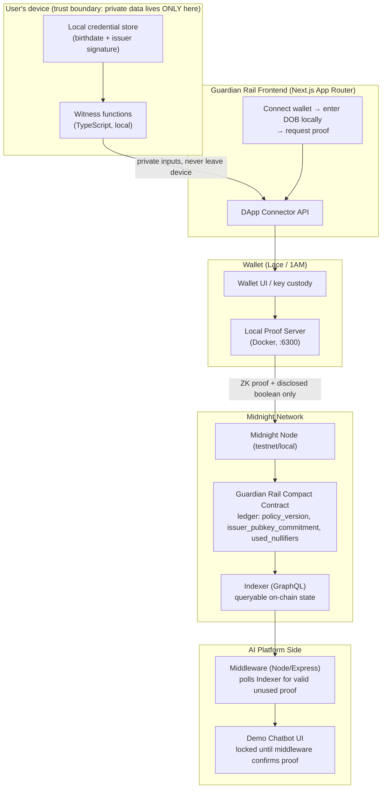
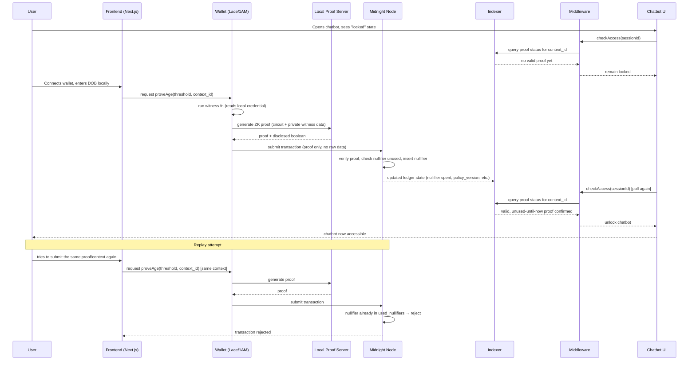

# Guardian Rail — Architecture Doc

## 1. System overview

Guardian Rail has four moving parts: a **user-side app** (where DOB/consent data lives and never leaves), a **wallet** (key custody + proof generation), the **Midnight network** (contract + ledger + nullifier tracking), and the **AI platform side** (middleware + the chatbot it protects). No component other than the user's own device ever sees the raw birthdate.



## 2. Component responsibilities

| Component | Responsibility | Never does |
|---|---|---|
| Local credential store | Holds the user's `(birthdate, issuer signature)` | Never transmitted anywhere, including to the wallet's backend |
| Witness functions | Feed private data into the circuit at proof-generation time | Never write to the public ledger directly |
| Wallet (Lace/1AM) | Key custody, orchestrates local proof generation, signs the transaction | Never sees a "plaintext age" concept — only sees circuit inputs/outputs per Compact's disclosure rules |
| Local Proof Server | Generates the ZK proof from the circuit + witness data | Never persists user data between runs (stateless prover) |
| Guardian Rail Contract | Verifies the proof, enforces the nullifier check, updates `used_nullifiers` | Never stores birthdate, signature, or user secret — only ever stores the boolean-adjacent commitments and nullifier hashes |
| Indexer | Lets the middleware query "is there a valid, unused proof for context X" | Never exposes any field the contract didn't already disclose |
| Middleware | Bridges the AI platform's session logic to on-chain proof state | Never asks the user for ID/DOB itself |
| Chatbot UI | The thing being protected | Never receives, requests, or stores age data |

## 3. Data flow — the "prove age" sequence



## 4. Trust boundaries (what's visible where)

- **Inside the user's device:** raw birthdate, issuer signature, user secret key. This never crosses out.
- **Crossing to the wallet/proof server:** the same private data, but only to *generate* a proof — the proof server is intended to be local (Docker on the user's own machine or the wallet's own sandboxed environment), not a third-party server.
- **Crossing to the Midnight network (public):** only the ZK proof itself, the disclosed boolean (`true`/`false`), and the derived nullifier hash. No birthdate, no signature, no user secret.
- **Visible to the AI platform (via Indexer/middleware):** only "this context_id has a valid, unused proof" — a boolean-shaped fact, nothing else.

## 5. Deployment topology

**Current local development:**
```
Docker: Midnight proof server only   (npm run env:up)
   ↕
localhost:6300 (proof server)
   ↕
Frontend (localhost:3000, Next.js dev server) + Middleware (localhost:4000)
```

The current browser flow uses a demo verifier and does not yet submit a real
Midnight proof. A local Midnight node and Indexer are future infrastructure,
not currently included in Docker Compose.

**Demo deployment (testnet, as a fallback layer, not a dependency):**
```
Midnight preprod/testnet node (hosted by Midnight Foundation)
   ↕
Testnet Indexer (hosted GraphQL endpoint)
   ↕
Your deployed contract address on testnet
   ↕
Frontend + Middleware pointed at testnet endpoints instead of localhost
```
Keep both configurations working via an environment variable switch (`NETWORK=local` vs `NETWORK=testnet`) so a flaky testnet or conference wifi doesn't sink the live demo — default to local for the actual judging run, and only show testnet if asked "does this actually work on the real network."

## 6. Why this shape satisfies the judging criteria

- **Technology:** exercises the full Compact privacy model — witnesses, `disclose()`, nullifiers, sealed ledger fields — not just a toy counter contract.
- **Originality:** applies Midnight's canonical "compliant identity" pattern to a specific, currently-contested problem (AI chatbot age verification) rather than a generic demo.
- **Completion:** the local-first deployment topology means you can guarantee a working end-to-end demo even if testnet or wifi misbehaves.
- **Business value:** the middleware/chatbot split mirrors exactly how a real AI platform would integrate this — as a bolt-on gate in front of existing infrastructure, not a rewrite.
